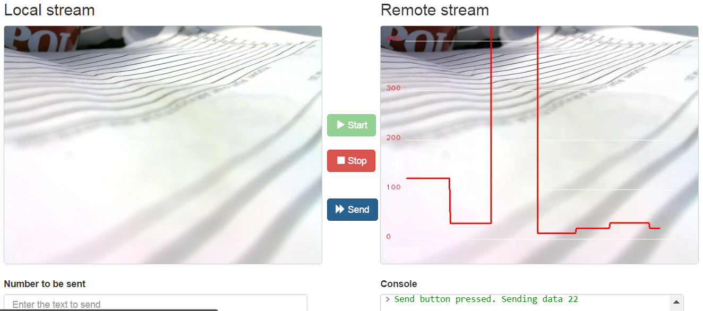

%%%%%%%%%%%%%%%%
Developers Guide
%%%%%%%%%%%%%%%%

This documents provides information how to develope the MultisensoryDataModule (MsData).

Clone repository:

.. code:: bash

    sudo apt-get install git
    git clone https://github.com/nubomedia-vtt/msdata.git

Create a folder to build the MsData

.. code:: bash

    mkdir build
    cd build

Kurento Client Interface
===========================

Now you have an option to generate either Java or JavaScript interface
for the Kurento Client (or naturally both if you need)

Java version

.. code:: bash

    cmake .. -DGENERATE_JAVA_CLIENT_PROJECT=TRUE

JavaScript version

.. code:: bash

    cmake .. -DGENERATE_JS_CLIENT_PROJECT=TRUE

Developing Source Code
===========================

To use the compiled results in Kurento just set into:

.. code:: bash

    /etc/default/kurento-media-server-6.0

for example:

.. code:: bash

    NAME=$(logname)
    export KURENTO_MODULES_PATH=$KURENTO_MODULES_PATH:/home/$NAME/nubomedia/msdata/build
    export GST_PLUGIN_PATH=$GST_PLUGIN_PATH:/home/$NAME/nubomedia/msdata/builds

MsData Interface ie Data Pads
===========================

Both MsData and the filter that utilized MsData through data pads must naturally agree on the data that is delivered  but flexible interface between modules is enabled. As a consequence functionality of the MsData can be increased without affecting the MsData interface.

Data Channel Demo
===========================

As an example about utilization of MsData with data channel, familiarize with `a graph demo <https://github.com/nubomedia-vtt/msdatademopaasgraph.git>`__ , ie 'Hello World App', which sends user defined data for drawing a graph.

The media pipeline is done with the following structure:

.. code:: bash

	    KmsMsData kmsMsData = new KmsMsData.Builder(mediaPipeline).build();
	    webRtcEndpoint.connect(kmsMsData);
	    kmsMsData.connect(webRtcEndpoint);	    

Currently the functionality is driven through interpretation of the given data. Explicit functionality can be added as necessary. The current implementation interprets the given data as a series of integers that are visualized as a graph. There are plans to develop some new applications which might eg instead of series of integers utilize JSON as data in the future.

