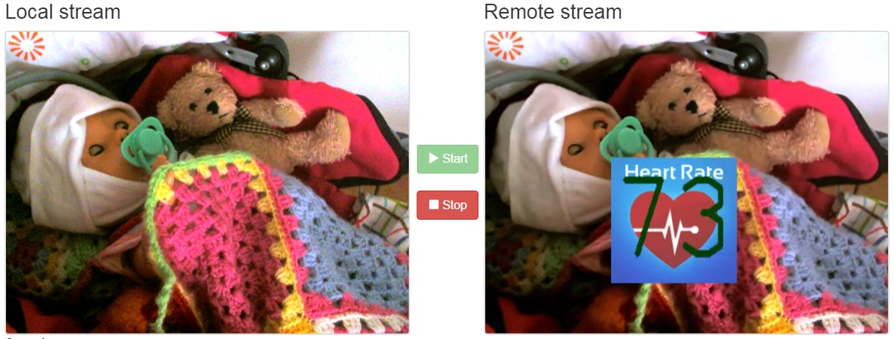
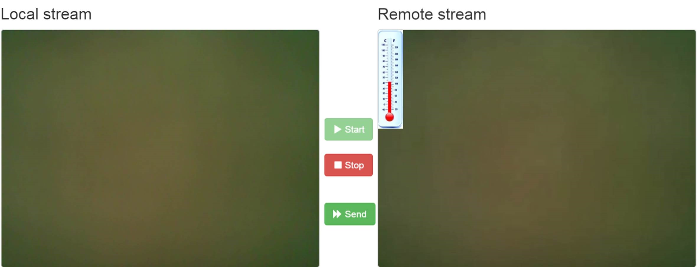
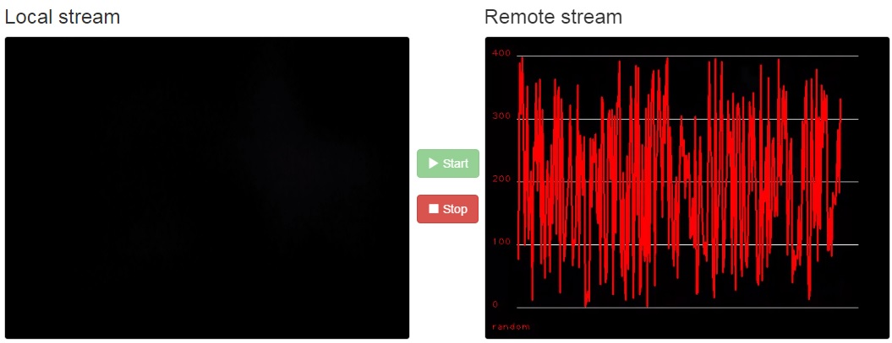

.. _README:

*****
Readme
*****
This project is part of NUBOMEDIA
`www.nubomedia.eu <http://www.nubomedia.eu>`__

**MultisensoryDataFilter (MsData)**

The repository contains documentation for installing and utilising the MsData. The repository contains description of the architecture of the MsData and also the source code of the MsData implementation.

MsData implements multi-domain AR filter providing 2D graphics visualisation service to other modules through data pads. Data channels are utilized thus MsData Interface enables sending of different kinds of content based on the identification and variable arguments thus the format of the data is quite flexible. Developers can create new visualisations not yet known thus extending MsData. Example for drawing a graph is available. Because the filter needs to support data-pads, the filter is based on Kurento GStreamer module. Refer the 
`Kurento documentation <http://www.kurento.org/>`__ 
for a more complete view of the Kurento architecture.

The following image show the current visualisations provided ie heart rate, temperature and graph. In addition, speed meter visualisation is considered.

**License**

Kurento is distributed as Open Source Software basing LGPL v2.1 license.

**Contribution policy**

You can contribute to the Nubomedia community through bug-reports, bug-fixes, new code or new documentation. For contributing to the Nubomedia community, drop a post to the [Nubomedia Public Mailing List] providing full information about your contribution and its value. In your contributions, you must comply with the following guidelines

* You must specify the specific contents of your contribution either through a
  detailed bug description, through a pull-request or through a patch.
* You must specify the licensing restrictions of the code you contribute.
* For newly created code to be incorporated in the Nubomedia code-base, you must
  accept Nubomedia to own the code copyright, so that its open source nature is
  guaranteed.
* You must justify appropriately the need and value of your contribution. The
  Nubomedia project has no obligations in relation to accepting contributions
  from third parties.
* The Nubomedia project leaders have the right of asking for further
  explanations, tests or validations of any code contributed to the community
  before it being incorporated into the Nubomedia code-base. You must be ready to
  addressing all these kind of concerns before having your code approved.

Support

-------
Support is provided through the [Nubomedia Public Mailing List]

[NUBOMEDIA]: http://www.nubomedia.eu
[Nubomedia Public Mailing List]: https://groups.google.com/forum/#!forum/nubomedia-dev
